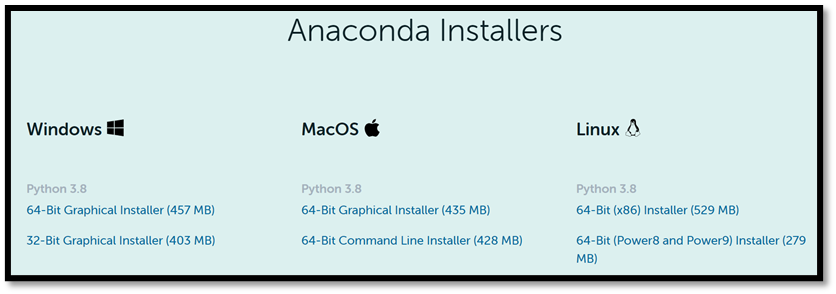
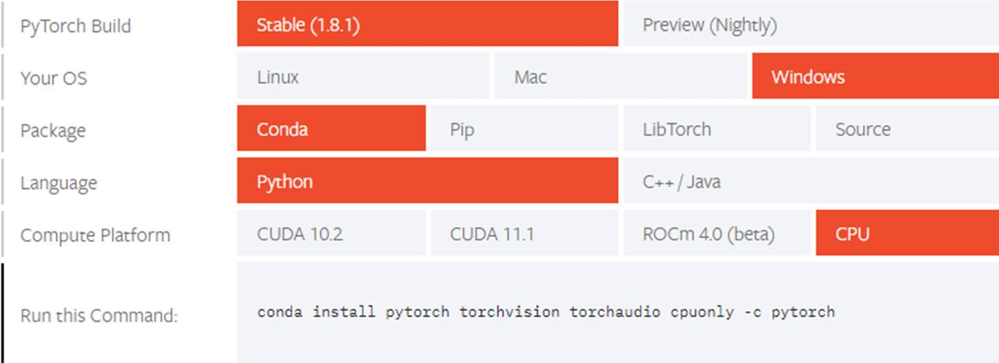
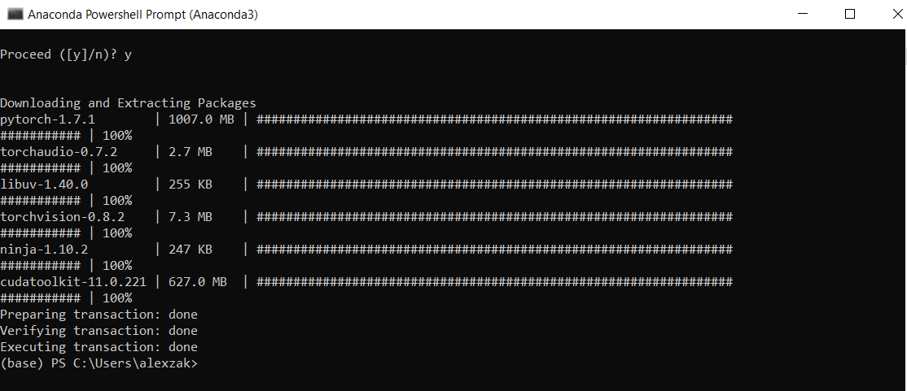

# Install and configure PyTorch on your machine.

> [!NOTE]
> For greater functionality, [PyTorch can also be used with DirectML on Windows](../../directml/pytorch-windows.md).


In the [previous stage of this tutorial](pytorch-intro.md), we discussed the basics of PyTorch and the prerequisites of using it to create a machine learning model. Here, we'll install it on your machine.

## Get PyTorch

First, you'll need to setup a Python environment.  

We recommend setting up a virtual Python environment inside Windows, using Anaconda as a package manager. The rest of this setup assumes you use an Anaconda environment. 

1. [Download and install Anaconda here](https://www.anaconda.com/products/individual). Select `Anaconda 64-bit installer for Windows Python 3.8`.

> [!IMPORTANT]
> Be aware to install Python 3.x. Currently, PyTorch on Windows only supports Python 3.x; Python 2.x is not supported. 



After the installation is complete, verify your Anaconda and Python versions. 

2. Open Anaconda manager via Start - Anaconda3 - Anaconda PowerShell Prompt and test your versions:

You can check your Python version by running the following command: `python –-version`

You can check your Anaconda version by running the following command: `conda –-version`


Now, you can install PyTorch package from binaries via Conda. 

3. Navigate to https://pytorch.org/.

Select the relevant PyTorch installation details: 

* PyTorch build – stable. 
* Your OS – Windows 
* Package – Conda  
* Language – Python 
* Compute Platform – CPU, or choose your version of Cuda. In this tutorial, you will train and inference model on CPU, but you could use a Nvidia GPU as well.  



4. Open Anaconda manager and run the command as it specified in the installation instructions.

```
conda install pytorch torchvision torchaudio cpuonly -c pytorch
```


5. Confirm and complete the extraction of the required packages. 



Let’s verify PyTorch installation by running sample PyTorch code to construct a randomly initialized tensor. 

6. Open the Anaconda PowerShell Prompt and run the following command.

```
python
```

Next, enter the following code: 

```
import torch 

x = torch.rand(2, 3) 

print(x)
```

The output should be a random 2x3 tensor. The numbers will be different, but it should look similar to the below.


> [!NOTE]
> Interested in learning more? Visit the [PyTorch official website](https://pytorch.org/)  

## Next Steps

Now that we've installed PyTorch, we're ready to [set up the data for our model](pytorch-data.md).
