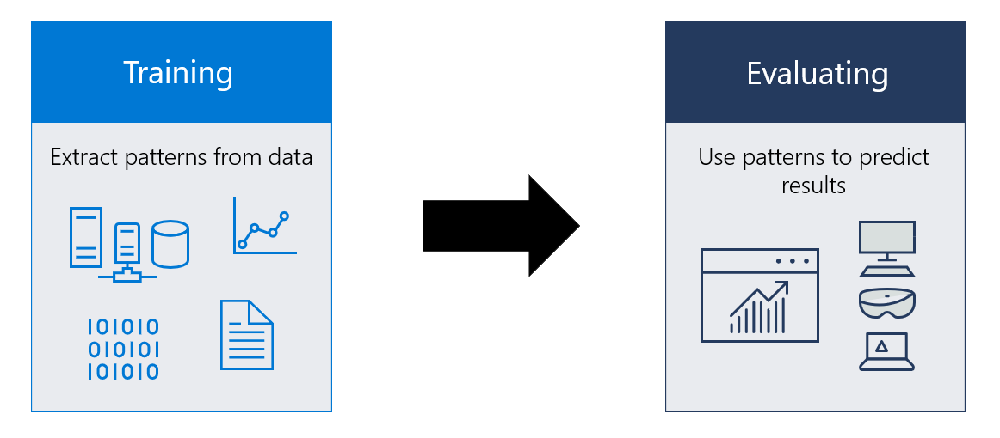

# What is a machine learning model?

> [!IMPORTANT]
> For the latest documentation about Windows Machine Learning, see [What is Windows ML](/windows/ai/new-windows-ml/overview). That documentation describes APIs that are in the **Microsoft.Windows.AI.MachineLearning** namespace, which ships in the Windows App SDK. Those APIs supersede the ones documented here, which are in the **Windows.AI.MachineLearning** namespace, and were shipped in 2018.

A machine learning model is an object (stored locally in a file) that has been trained to recognize certain types of patterns. You train a model over a set of data, providing it an algorithm that it can use to reason over and learn from those data.

Once you have trained the model, you can use it to reason over data that it hasn't seen before, and make predictions about those data. For example, let's say you want to build an application that can recognize a user's emotions based on their facial expressions. You can train a model by providing it with images of faces that are each tagged with a certain emotion, and then you can use that model in an application that can recognize any user's emotion.

## When to use Machine Learning

Good machine learning scenarios often have the following common properties: 
1.	They involve a repeated decision or evaluation which you want to automate and need consistent results.
2.	It is difficult or impossible to explicitly describe the solution or criteria behind a decision.
3.	You have labeled data, or existing examples where you can describe the situation and map it to the correct result.

Windows Machine Learning uses the [Open Neural Network Exchange (ONNX)](https://onnx.ai/) format for its models. You can download a pre-trained model, or you can train your own model. See [Get ONNX models for Windows ML](get-onnx-model.md) for more information.

## Get started

You can get started with Windows Machine Learning by following [one of our full-app tutorials](tutorials/index.md) or jumping straight to the [Windows Machine Learning samples](samples.md).

[!INCLUDE [help](../includes/get-help.md)]
